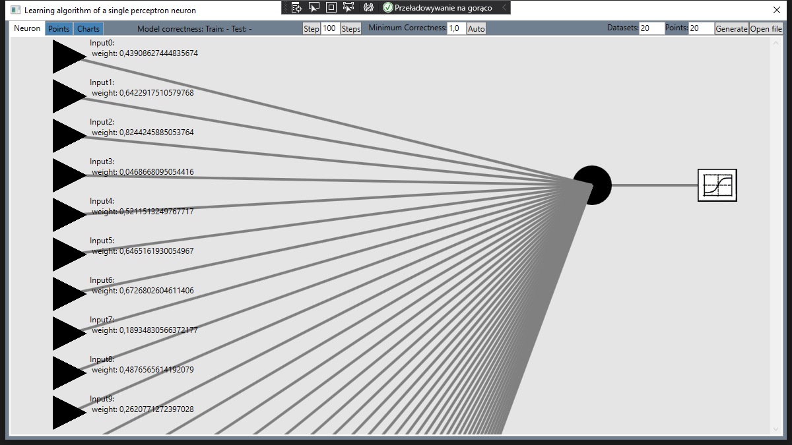
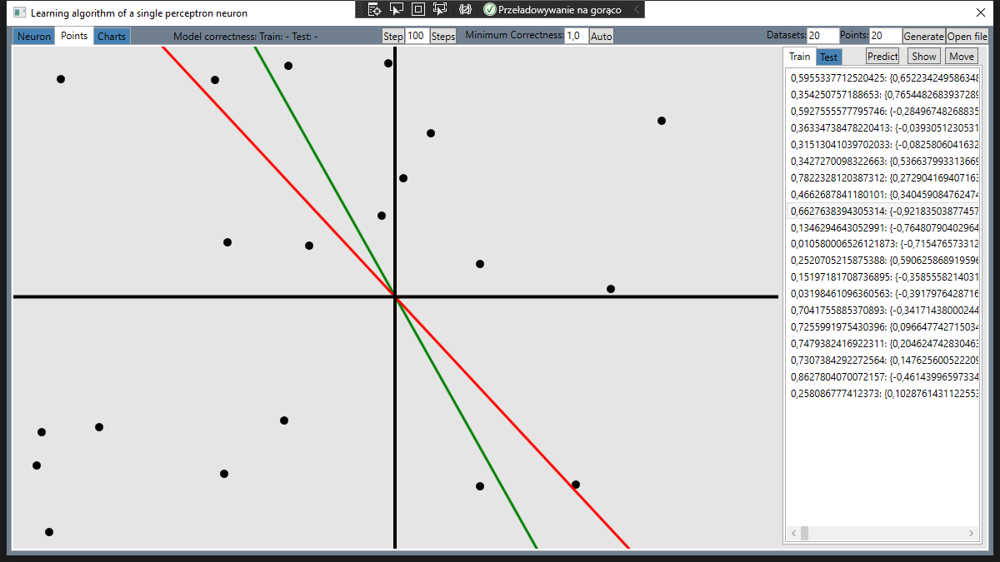
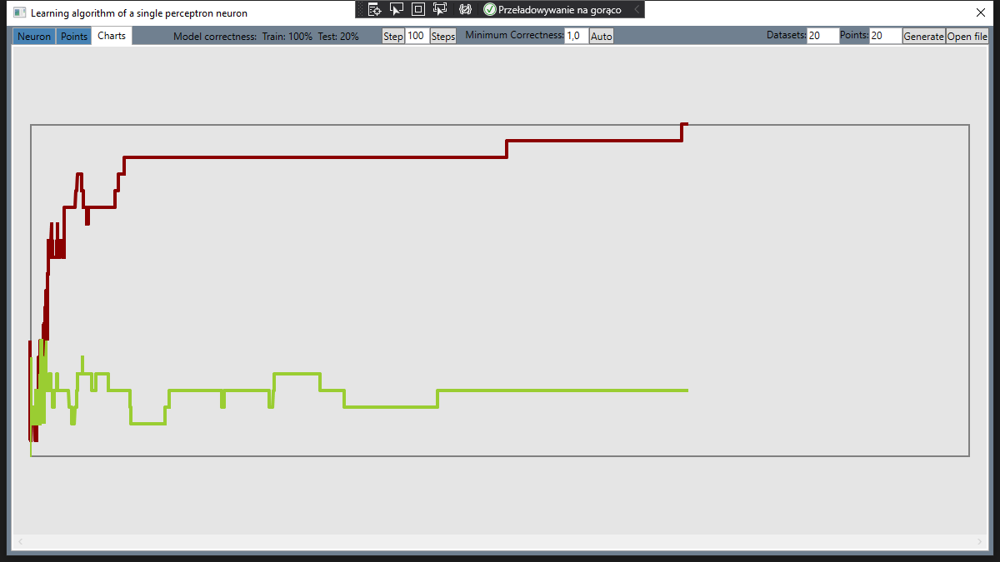

# Single perceptron visalisation
For educational purpouses only.

## Features:
- Supports perceptron learning (with multiple inputs),
- Supports reading data from .arff files,
- Simple chart of model correctness,
- Self implemented neural network (you can take a look into SingleNeuronVisualisation\Algorytm directory).

## Appearance:

